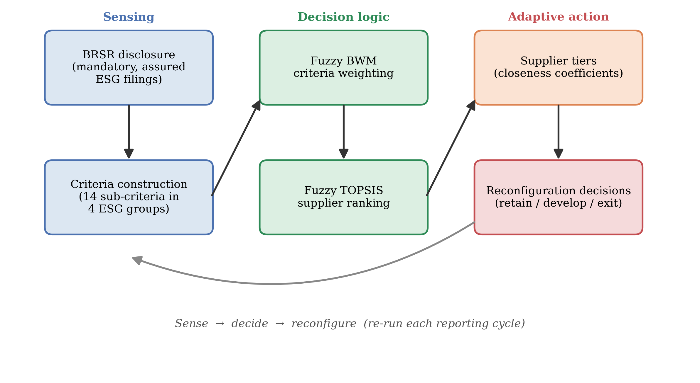
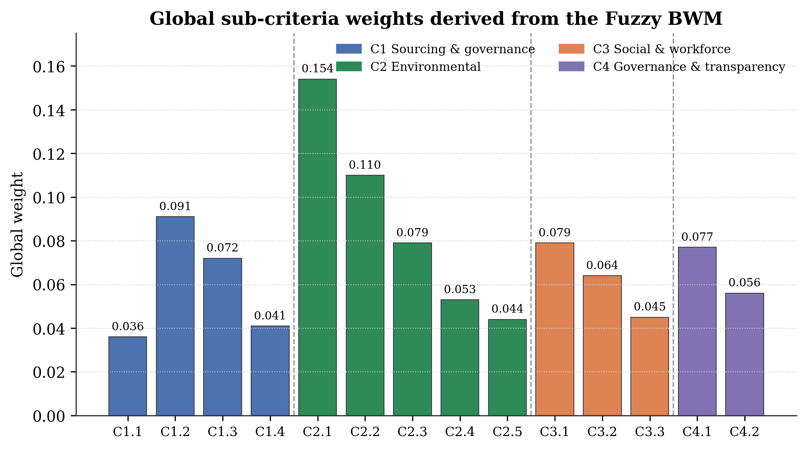
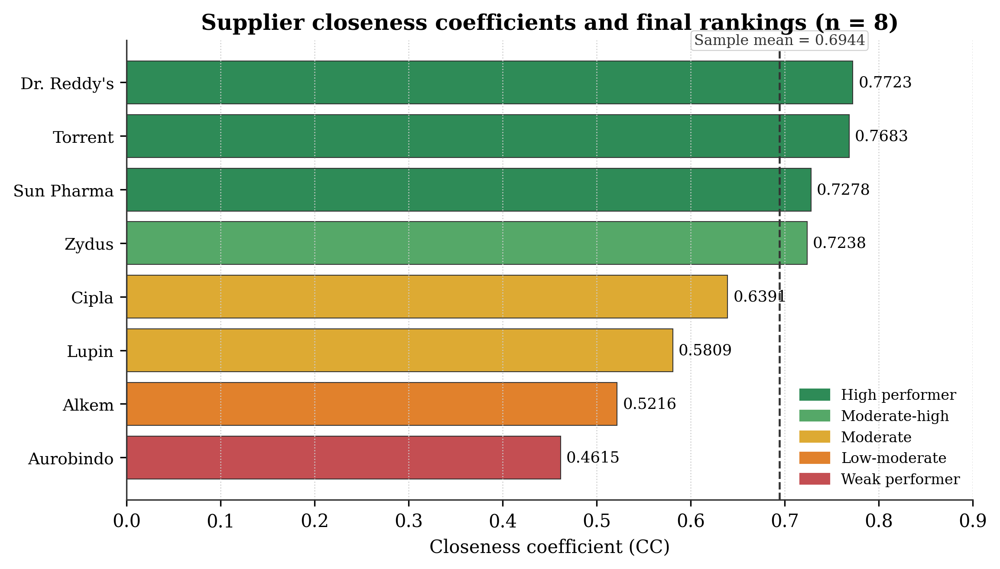
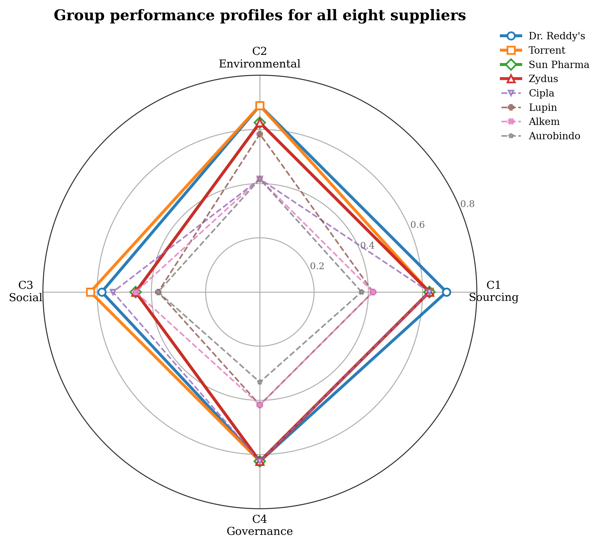
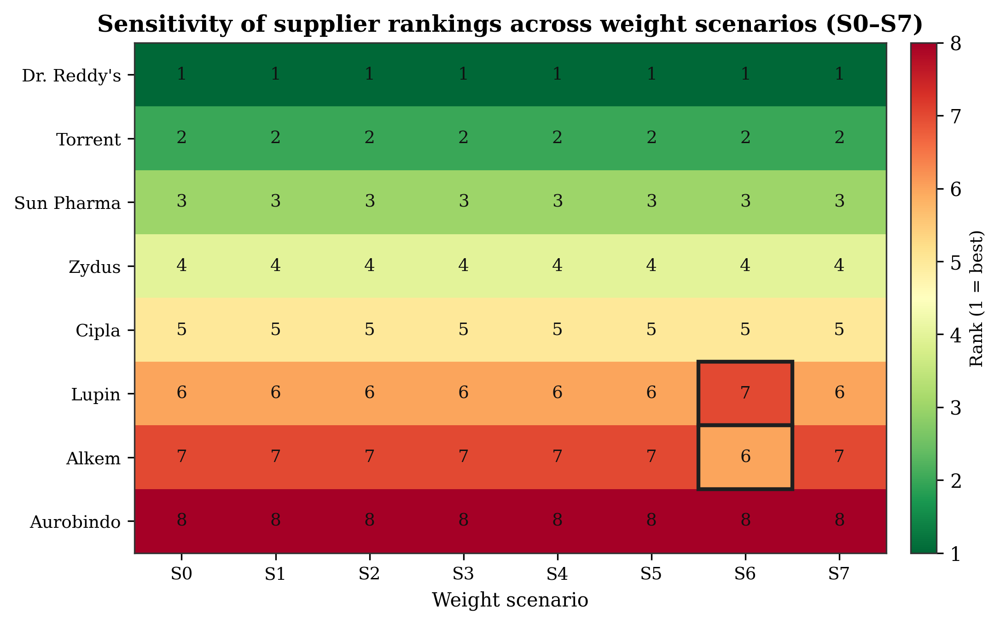
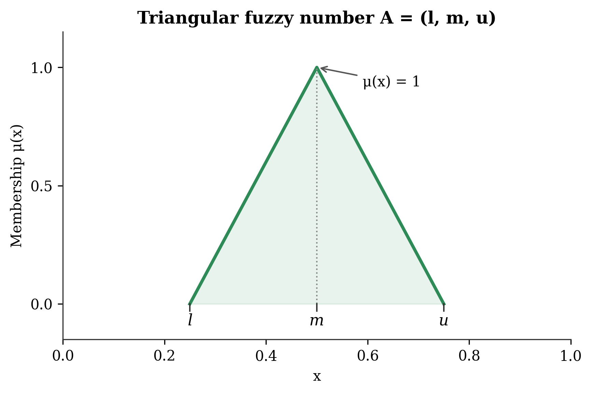

# Turning Mandatory ESG Disclosure into Supply-Base Flexibility: A Disclosure-Anchored Decision Framework for Resilient and Adaptive Pharmaceutical Supply Chains

## ABSTRACT

Organizations increasingly compete on their capacity to reconfigure operations quickly as regulatory, environmental and stakeholder conditions shift, making flexibility, adaptability and resilience central concerns of contemporary systems management. This study examines how mandatory environmental, social and governance (ESG) disclosure can be converted into an adaptive mechanism for governing the supply base under conditions of uncertainty. Focusing on India's Business Responsibility and Sustainability Reporting (BRSR) regime and the environmentally exposed pharmaceutical industry, the paper asks how regulated ESG data can help focal firms sense, prioritise and reconfigure their supplier portfolios towards more resilient and environmentally superior configurations. We develop a disclosure-anchored decision framework that treats assured BRSR filings as a standing information infrastructure, and we combine the Fuzzy Best-Worst Method to weight ESG criteria with Fuzzy TOPSIS to rank eight major listed Indian pharmaceutical firms across fourteen environmental and ESG sub-criteria. The findings show that environmental criteria dominate supplier prioritisation, with greenhouse-gas emission intensity and renewable-energy adoption emerging as the most decisive levers, while community-oriented criteria are comparatively marginal. The rankings remain stable across eight alternative weighting scenarios, indicating that the resulting supply-base configuration is robust rather than an artefact of a particular set of priorities. Theoretically, the study reframes a national disclosure mandate as a source of decision-making flexibility and adaptive capacity, integrating institutional, stakeholder, legitimacy and dynamic-capability perspectives to explain how disclosure pressure is transmitted upstream. Practically, it offers a transparent, replicable and audit-ready decision-support tool that links disclosure regulation to resilient supplier governance, contributing to the flexible systems management agenda on managing sustainability under uncertainty.

**Keywords:** Supply chain flexibility; Supply chain resilience; Organizational adaptability; Decision-making under uncertainty; ESG disclosure (BRSR); Fuzzy multi-criteria decision-making; Supplier governance; Pharmaceutical supply chains

---

## 1. INTRODUCTION

Firms today are judged less on the stability of their operations than on their ability to adapt when conditions change. Climate risk, tightening environmental regulation and intensifying stakeholder scrutiny have moved the environmental performance of supply chains from an operational concern to a test of organizational flexibility: the capacity to sense pressure, weigh options and reconfigure the supply base with minimum time and effort (Singh et al., 2021). Firms are no longer evaluated only on the cost, quality and reliability of what they buy, but on the environmental and social conduct embedded across their value chains (Carter & Rogers, 2008; Sarkis et al., 2011; Seuring & Müller, 2008). Because a large share of a focal firm's environmental footprint, and of its exposure to regulatory and reputational risk, originates upstream, the governance of suppliers has become a strategic lever for building adaptive, resilient supply systems rather than an administrative afterthought (Gimenez & Tachizawa, 2012; Tachizawa & Wong, 2014). How firms select, monitor and reconfigure suppliers is therefore increasingly a question of supply chain flexibility and resilience.

A parallel and reinforcing development is the rise of mandatory ESG disclosure. Reporting regimes that were once voluntary and heterogeneous are being replaced by standardised, externally assured mandates that reshape corporate sustainability practice and the information environment in which decisions are made (Christensen et al., 2021; Dhaliwal et al., 2011; Ioannou & Serafeim, 2017). India offers a paradigmatic case. In 2021 the Securities and Exchange Board of India (SEBI) introduced the Business Responsibility and Sustainability Reporting (BRSR) framework, requiring the 1,000 largest listed entities by market capitalisation to disclose standardised ESG information; in 2023 it strengthened the mandate through BRSR Core, which imposes reasonable external assurance on a defined set of key performance indicators spanning greenhouse gas (GHG) intensity, energy and water use, waste, workforce safety and supply chain ESG assessment (SEBI, 2021, 2023). BRSR thus functions as more than a compliance artefact. It is at once a coercive institutional pressure and a public, comparable information infrastructure that, in principle, lets firms respond to environmental uncertainty with greater speed and precision (Delmas & Toffel, 2008; DiMaggio & Powell, 1983).

These pressures are acute in the pharmaceutical industry, which combines high environmental intensity, stringent regulation and direct public-health salience (Grimm et al., 2014; Sarkis & Talluri, 2002). Active pharmaceutical ingredient (API) synthesis, solvent use, water withdrawal and chemical waste generate substantial footprints, and the most environmentally exposed nodes are frequently the least monitored upstream suppliers (Grimm et al., 2014). India is the world's third-largest pharmaceutical producer by volume and the largest supplier of generic medicines, accounting for a substantial share of global generic exports and vaccine supply (Pharmexcil, 2024). The environmental conduct of Indian pharmaceutical suppliers is therefore of systemic, not merely national, importance, and it is now increasingly visible through BRSR disclosure.

This convergence creates a distinct tension that is central to the flexible systems management agenda: the simultaneous pursuit of sustainability and flexibility (Shukla et al., 2010). On one side, firms face coercive pressure to align their supply bases with corporate ESG commitments and net-zero trajectories under conditions of regulatory and investor scrutiny; failure to do so threatens their legitimacy with key stakeholders (Aguilera et al., 2007; Suchman, 1995). On the other side, the decision tools most firms use to evaluate suppliers were not designed for a mandatory-disclosure world: they typically rest on subjective expert surveys and proprietary judgements that are disconnected from regulated ESG data, prone to bias, and difficult to replicate or audit (Ecer, 2020; You et al., 2015; Zimmer et al., 2016). As a result, the adaptive promise of mandatory ESG disclosure, that it can become a standing instrument for governing suppliers flexibly and building resilience, has been neither realised in practice nor adequately theorised.

Two research streams remain largely disconnected. The ESG disclosure literature, including emerging work on BRSR, concentrates on firm-level reporting, its determinants and its capital-market consequences, but says little about how disclosures can be used to govern and adapt the supply base (Christensen et al., 2021; Dhaliwal et al., 2011). The sustainable supply chain governance literature examines codes of conduct, audits and supplier development, yet its supplier-evaluation models rarely draw on mandatory, externally assured ESG disclosures, relying instead on expert elicitation (Govindan et al., 2015; Gualandris et al., 2015; Zimmer et al., 2016). A growing body of flexibility research, much of it published in this journal, establishes that flexible strategies underpin supply chain resilience and adaptive performance under disruption (Agrawal et al., 2023; Chowdhury et al., 2024; Paul & Saha, 2024), yet it has not connected these capabilities to the standing information infrastructure that mandatory disclosure now provides. The result is a gap at the intersection of the three: disclosure-anchored, regulation-driven supplier governance as a source of supply-base flexibility and resilience is under-theorised and under-operationalised, particularly in the environmentally critical Indian pharmaceutical sector.

Against this backdrop, the present study asks three questions. First, how can firms use BRSR-mandated ESG disclosures as a standing infrastructure to govern and adapt suppliers in pharmaceutical supply chains? Second, which environmental and ESG dimensions are most decisive in aligning supplier portfolios with corporate sustainability strategy under a mandatory-disclosure regime? Third, what do the resulting patterns imply, theoretically and practically, for building flexible and resilient supply systems through the strategic use of regulatory disclosure? To answer these questions, we develop a disclosure-anchored decision framework that treats BRSR filings as the primary data infrastructure and combines the Fuzzy Best-Worst Method (Fuzzy BWM) for criteria weighting with Fuzzy TOPSIS for supplier ranking, applied to eight major listed Indian pharmaceutical firms. The method is deployed as a flexible decision-support instrument suited to imprecise, linguistically expressed information rather than as an end in itself; its technical machinery is summarised in the main text and detailed in Appendix A.

The study makes three contributions. Theoretically, it integrates institutional, stakeholder, legitimacy and dynamic-capability perspectives to explain how mandatory ESG disclosure becomes a mechanism for extending institutional pressure into the supply base and, in doing so, a source of adaptive capacity; it advances four propositions linking disclosure, supplier governance and supply-chain flexibility and resilience (Christensen et al., 2021; Sarkis et al., 2011; Settembre-Blundo et al., 2021; Tachizawa & Wong, 2014). Empirically and methodologically, it demonstrates how a national mandatory-disclosure regime can be turned into a transparent, replicable and audit-ready decision tool that supports rapid, low-friction reconfiguration of the supply base, avoiding the biases of survey-based evaluation (You et al., 2015; Zimmer et al., 2016). Practically, it offers corporate sustainability strategists, ESG and governance officers, investors and regulators an evidence-based account of how disclosure can be used to steer supply chains towards superior environmental performance and greater resilience. The remainder of the paper proceeds as follows. Section 2 develops the theoretical background and reviews the literature on flexibility, disclosure and supplier governance. Section 3 presents the decision framework and research design. Section 4 reports the results, Section 5 discusses their implications for flexibility and resilience, and Section 6 draws out theoretical, managerial and policy implications. Section 7 concludes with limitations and future research directions.

---

## 2. LITERATURE REVIEW

### 2.1 Flexibility, Adaptability and Resilience in Sustainable Supply Chains

Flexibility is the organizing concept of this study. In the flexible systems management tradition, flexibility denotes the provision of more options, quicker change mechanisms and greater freedom of choice, enabling organizations to respond to changing situations at the level of strategy, structure, systems, people and culture (Singh et al., 2021). Applied to supply chains, this capacity manifests as supply chain flexibility, the ability to adjust sourcing, capacity and configuration in response to uncertainty, which a substantial literature links to supply chain resilience and adaptive performance (Agrawal et al., 2023; Varma et al., 2024). Resilience, in turn, is the capacity of a supply system to prepare for, absorb, recover from and adapt to disruption; flexible strategies are among its most effective antecedents (Chowdhury et al., 2024; Hosseini Shekarabi et al., 2025; Paul & Saha, 2024). Recent evidence shows that flexibility is a robust predictor of coordination, resilience and robustness across supply networks, and that it is increasingly enabled by digital and Industry 4.0 capabilities that improve visibility and responsiveness (Agrawal et al., 2023; Pandey et al., 2024).

A recurring debate concerns whether flexibility and sustainability are complementary or competing objectives. Early work questioned whether the responsiveness gained through flexibility might come at an environmental cost, since faster delivery and customisation can raise resource use and emissions (Shukla et al., 2010). More recent contributions reframe the relationship: environmental adaptability, the capacity to reconfigure the supply base towards lower-impact suppliers, is itself a form of flexibility that builds resilience against regulatory and reputational shocks (Sarker et al., 2021; Settembre-Blundo et al., 2021). This study is positioned squarely within that reframing. It treats disclosure-anchored supplier governance as a mechanism through which firms acquire the environmental adaptability needed to keep sustainability and flexibility together rather than in tension.

### 2.2 ESG Disclosure and Mandatory Reporting Regimes as Sources of Adaptive Capacity

Corporate ESG disclosure has evolved from a voluntary, reputational exercise into a structured determinant of strategy and, potentially, a source of adaptive capacity. Early frameworks such as the Global Reporting Initiative standardised voluntary sustainability reporting, but their uptake, scope and assurance quality varied widely, limiting comparability across firms (Bai & Sarkis, 2010). A substantial body of work shows that disclosure is strategically consequential: firms that report credible non-financial information lower their cost of equity capital and strengthen investor relations (Dhaliwal et al., 2011), and disclosure choices are used to manage the expectations of powerful stakeholders (Aguilera et al., 2007). At the same time, voluntary regimes are vulnerable to selective disclosure and greenwashing, where firms publicise favourable indicators while omitting unfavourable ones (Delmas & Burbano, 2011; Marquis et al., 2016).

Mandatory reporting regimes change this calculus in ways that matter for flexibility. By specifying which indicators must be disclosed and, increasingly, requiring external assurance, they raise the evidentiary standard of ESG data and constrain selective disclosure (Christensen et al., 2021; Ioannou & Serafeim, 2017). Standardised, assured data reduce the information-processing burden of monitoring suppliers and thereby lower the cost of adjusting the supply base, converting disclosure into a standing sensing capability. India's BRSR framework exemplifies this shift. Its nine principles align with the National Guidelines on Responsible Business Conduct and overlap substantially with the GRI Universal Standards and climate-disclosure recommendations, while BRSR Core adds reasonable third-party assurance on a defined KPI set covering GHG intensity, energy, water, waste, workforce safety and supply chain ESG assessment (SEBI, 2021, 2023). The literature, however, has examined BRSR and comparable mandates almost exclusively at the level of the reporting firm; how these disclosures might be used to govern suppliers flexibly and build resilience remains largely unaddressed.

### 2.3 Sustainable Supply Chain Governance and Disclosure-Anchored Supplier Management

Research on sustainable supply chain management (SSCM) establishes that a firm's environmental and social performance is co-produced with its suppliers, making the supply base a source of both risk and competitive advantage (Carter & Rogers, 2008; Seuring & Müller, 2008). Governance of sustainability in the supply base operates through mechanisms such as supplier codes of conduct, ESG criteria in sourcing decisions, audits, certification and supplier development (Gimenez & Tachizawa, 2012; Gualandris et al., 2015). Two broad governance logics are distinguished: assessment, in which buyers evaluate and monitor supplier conduct, and collaboration, in which buyers build supplier capability (Gimenez & Tachizawa, 2012; Marshall et al., 2015). Both are more effective when supplier performance is visible, and extending sustainability beyond first-tier suppliers is recognised as especially difficult precisely because visibility declines upstream (Foerstl et al., 2010; Tachizawa & Wong, 2014).

Much of this work is either qualitative and managerial or relies on expert-driven multi-criteria models, and its data on supplier performance typically come from private audits or surveys rather than public, comparable disclosure (Govindan et al., 2015; Zimmer et al., 2016). Gualandris et al. (2015) argue that credible, verifiable evaluation is central to the accountability of sustainable supply chains, yet verification remains costly and fragmented. Bai and Sarkis (2010) demonstrated the feasibility of deriving supplier sustainability ratings from public GRI disclosures, but the voluntary, unassured nature of those reports limited comparability and, with it, the speed and confidence with which a buyer could act. The possibility that a mandatory, externally assured disclosure regime could anchor supplier governance, and thereby lower the cost and raise the credibility of adaptive supplier decisions, has not been developed.

### 2.4 Fuzzy Multi-Criteria Decision-Making as Flexible Decision Support under Uncertainty

Supplier selection has long been modelled as a multi-criteria decision-making (MCDM) problem (Dickson, 1966; Weber et al., 1991), and the incorporation of sustainability has expanded the criteria set to include environmental and social dimensions alongside cost, quality and delivery (Govindan et al., 2015). Because supplier sustainability information is often imprecise and expressed in linguistic terms, fuzzy set theory (Bellman & Zadeh, 1970; Zadeh, 1965) is widely used to represent such uncertainty, with TOPSIS (Hwang & Yoon, 1981) and its fuzzy extension providing a robust ranking apparatus well suited to decision-making under ambiguity (Awasthi et al., 2010; Chen, 2000; Kannan et al., 2013). For criteria weighting, the Best-Worst Method reduces the number of pairwise comparisons and yields more consistent, uniquely determined weights than the Analytic Hierarchy Process, which has itself been applied to green sourcing (Lee et al., 2009; Rezaei, 2015, 2016; Saaty, 1980); its fuzzy extension accommodates linguistic imprecision (Guo & Zhao, 2017). Hybrid Fuzzy BWM-TOPSIS designs have proven effective for green supplier selection (Büyüközkan & Çifçi, 2012; Gupta & Barua, 2017), and multi-method fuzzy designs have recently been used to build resilience-strategy portfolios under disruption (Chowdhury et al., 2024).

These methods are attractive for the present purpose because they treat uncertainty as intrinsic rather than as noise to be eliminated, which is precisely what a flexible decision-support system requires. They nonetheless share a limitation relevant to this study: they are almost always populated with expert judgements or survey ratings rather than mandatory, externally assured ESG disclosures, and they are rarely connected to regulatory compliance regimes (Ecer, 2020; You et al., 2015; Zimmer et al., 2016). As a consequence, their outputs are difficult to reproduce and audit, and they remain detached from the disclosure environment that now shapes corporate sustainability strategy. Repurposing these tools to operate on regulated ESG disclosure is the methodological move this study makes.

### 2.5 Theoretical Framing: Institutional, Stakeholder, Legitimacy and Dynamic-Capability Perspectives

We interpret BRSR-driven supplier governance through four complementary lenses. Institutional theory explains why organisations converge on similar practices under external pressure. DiMaggio and Powell (1983), building on Meyer and Rowan (1977), identify coercive, mimetic and normative isomorphism as mechanisms through which fields become homogeneous. A mandatory disclosure regime such as BRSR is a prototypical coercive pressure: it compels listed firms to measure, assure and publish specified environmental indicators (SEBI, 2021, 2023). Crucially, these pressures do not stop at the focal firm. Because a firm's disclosed environmental performance depends partly on its suppliers, and because value-chain disclosure is being extended under BRSR, focal firms have an incentive to transmit the pressure upstream, converting a firm-level mandate into supply-base governance (Delmas & Toffel, 2008; Tachizawa & Wong, 2014). Firms nevertheless retain strategic agency in how they respond, ranging from acquiescence to manipulation (Oliver, 1991; Scott, 2014).

Stakeholder theory explains whose expectations drive this behaviour. Firms manage relationships with salient stakeholders, investors, regulators, customers and communities, whose claims must be balanced for the firm to prosper (Aguilera et al., 2007; Freeman, 1984). Standardised ESG disclosure lowers the information asymmetry between firms and these stakeholders, making supplier-related environmental performance observable and therefore governable. Legitimacy theory explains the motive: firms seek to demonstrate that their conduct is appropriate within socially constructed norms, and disclosure-based supplier governance is a means of acquiring, maintaining and repairing legitimacy (Bansal & Roth, 2000; Suchman, 1995). Where disclosure is voluntary, legitimacy can be pursued symbolically through greenwashing (Delmas & Burbano, 2011; Marquis et al., 2016); mandatory assurance constrains such symbolic responses and pushes firms towards substantive action, including reconfiguration of the supply base.

The dynamic-capability and natural-resource-based perspectives connect these pressures to flexibility. The natural-resource-based view treats superior environmental performance as a source of competitive advantage (Hart, 1995), while work on flexibility and resilience under uncertainty shows that the capacity to sense risk and reconfigure resources is itself a valuable, adaptive capability (Settembre-Blundo et al., 2021). Read together, the four lenses imply that disclosure-anchored supplier governance is simultaneously a response to institutional pressure, a means of managing stakeholders, a legitimacy strategy, and a dynamic capability that enhances the flexibility and resilience of the supply system.

From this integrated framing we derive four propositions that link ESG disclosure, supplier governance and supply-chain flexibility and resilience, and that guide the interpretation of our results:

**Proposition 1.** Under a mandatory, externally assured ESG disclosure regime, coercive institutional pressure raises the strategic salience of environmental criteria, so that firms weight supplier environmental performance, especially GHG intensity and renewable-energy adoption, above social and governance criteria in supplier evaluation.

**Proposition 2.** Standardised, assured ESG disclosure reduces buyer-supplier information asymmetry, enabling disclosure-anchored supplier governance that is more replicable and auditable than private survey- or audit-based evaluation, and that lowers the cost and friction of reconfiguring the supply base.

**Proposition 3.** To secure legitimacy with investors, regulators and other salient stakeholders, focal firms use disclosure-based supplier benchmarking to reconfigure their supply bases towards environmentally superior suppliers, thereby cascading institutional pressure upstream and increasing the adaptive capacity of the supply chain.

**Proposition 4.** Aligning supplier portfolios with disclosed environmental performance strengthens supply-chain environmental outcomes and resilience while reducing regulatory and reputational risk, linking supplier governance to firm-level competitive and legitimacy advantages.

### 2.6 Synthesis and Research Gap

Table 1 synthesises the most directly relevant studies by theme, method and contribution. Read through the framing above, the synthesis reveals a coherent gap. ESG disclosure research establishes that mandatory reporting reshapes strategy but stops at the firm boundary; SSCM research establishes the importance of supplier governance but relies on private or expert data; flexibility and resilience research establishes that flexible strategies underpin adaptive supply chains but has not connected them to the standing information infrastructure of mandatory disclosure; and fuzzy MCDM research offers robust decision tools that remain disconnected from regulated disclosure. No prior study theorises or operationalises BRSR-anchored, disclosure-driven supplier governance as a source of supply-base flexibility and resilience in the environmentally critical Indian pharmaceutical sector. This study occupies precisely that intersection.

**Table 1.** Synthesis of key studies by theme, method and contribution

| Study | Journal | Method | Key contribution | Relevance to this study |
|---|---|---|---|---|
| Shukla et al. (2010) | Glob. J. Flex. Syst. Manag. | Conceptual/empirical | Examines whether flexibility and sustainability of supply chains coexist | Frames the flexibility-sustainability tension addressed here |
| Settembre-Blundo et al. (2021) | Glob. J. Flex. Syst. Manag. | Interpretive framework | Sustainability-based risk management for flexible, resilient decisions | Grounds disclosure as a source of adaptive capacity |
| Agrawal et al. (2023) | Glob. J. Flex. Syst. Manag. | Survey/SEM | Supply chain flexibility drives coordination, resilience, robustness | Positions flexibility as antecedent of resilient supply systems |
| Chowdhury et al. (2024) | Glob. J. Flex. Syst. Manag. | Multi-method/fuzzy sQCA | Resilience-capability portfolios for severe disruption | Methodological kin; flexibility via configurational analysis |
| Paul and Saha (2024) | Glob. J. Flex. Syst. Manag. | Systematic review | Flexible strategies and performance indicators for resilience | Links flexible strategies to resilience outcomes |
| Sarker et al. (2021) | Glob. J. Flex. Syst. Manag. | MCDM | Social-sustainability challenges toward flexible SCM | Sustainability as a driver of flexible governance |
| Seuring and Müller (2008) | J. Clean. Prod. | Literature review | Triple-bottom-line SSCM framework | ESG framework; sustainability criteria grouping |
| Carter and Rogers (2008) | IJPDLM | Conceptual | Stakeholder theory and risk in SSCM | Theoretical grounding for pharma SC sustainability |
| Govindan et al. (2015) | J. Clean. Prod. | Systematic review | 197 green supplier selection papers; MCDM dominance | Criteria list; research-gap identification |
| Zimmer et al. (2016) | Int. J. Prod. Res. | Systematic review | 113 sustainable supplier management papers | Survey-data limitation; secondary-data gap |
| Rezaei (2015, 2016) | Omega | Methodology | Best-Worst Method; linear model, unique weights | Core weighting methodology |
| Guo and Zhao (2017) | Knowl.-Based Syst. | Methodology | Fuzzy BWM with TFN comparisons | Fuzzy extension of BWM |
| Chen (2000) | Fuzzy Sets Syst. | Methodology | Fuzzy TOPSIS with FPIS/FNIS | Core ranking methodology |
| Gupta and Barua (2017) | J. Clean. Prod. | Case study | Hybrid BWM-Fuzzy TOPSIS for green suppliers | Direct methodological precedent |
| Bai and Sarkis (2010) | Int. J. Prod. Econ. | Case study | Supplier sustainability from public GRI data | Secondary-disclosure precedent |
| Grimm et al. (2014) | Int. J. Prod. Econ. | Case study | Sub-supplier management in pharma supply chains | Pharma-sector justification |
| Ecer (2020) | Oper. Res. | Case study | Interval type-2 fuzzy AHP green supplier selection | Survey-dependency limitation |

---

## 3. METHODOLOGY

### 3.1 Research Design and the Flexibility Logic of the Framework

The framework is best understood not as a technical exercise but as a flexible decision-support system that helps firms align their supplier portfolios with corporate sustainability strategy under a mandatory-disclosure regime. It supports a sense-decide-reconfigure cycle: BRSR disclosure provides the sensing capability, fuzzy weighting and ranking provide the decision logic, and the resulting tiers translate into reconfiguration options for the supply base. Concretely, it addresses two decisions that every ESG-conscious buyer faces. Which sustainability dimensions should carry the most weight in sourcing, given regulatory and stakeholder salience? And how do candidate suppliers compare against an ideal environmental profile once those priorities are applied? The first decision is supported by the Fuzzy Best-Worst Method, which translates managerial judgements about the strategic importance of ESG dimensions into transparent, internally consistent weights; the second is supported by Fuzzy TOPSIS, which converts disclosed performance into a ranked portfolio suitable for retention, development or exit decisions. Both steps are populated exclusively from BRSR disclosure, so the tool is replicable, audit-ready and directly tied to the regulatory regime that shapes firm strategy. Figure 1 summarises the process from ESG reporting through criteria construction and weighting to supplier ranking and reconfiguration decisions; the underlying fuzzy arithmetic, linguistic scales and distance formulae are consolidated in Appendix A so that the main text remains focused on the flexibility and governance logic.

**Figure 1.** Flexible decision process: from BRSR disclosure to adaptive supplier-governance decisions

### 3.2 BRSR as Strategic Data Infrastructure for Adaptive Governance

All performance data are drawn from mandatorily disclosed, externally assured BRSR filings submitted by listed Indian pharmaceutical firms on the Bombay Stock Exchange (BSE) and the National Stock Exchange (NSE), supplemented by firms' standalone ESG reports and, where relevant, GRI-aligned disclosures. Relying on assured regulatory disclosure rather than expert surveys is both a methodological and a strategic choice. It removes the response bias, small and homogeneous panels and non-replicability that constrain survey-based supplier evaluation (Ecer, 2020; You et al., 2015; Zimmer et al., 2016), and it grounds the analysis in the very information environment to which boards, investors and regulators now attend (Christensen et al., 2021; Ioannou & Serafeim, 2017). Because the filings are updated each reporting cycle, the framework becomes a standing, always-current sensing capability rather than a one-off study, which is what gives it adaptive value. In institutional terms, it operationalises the coercive pressure of BRSR as usable governance information (Proposition 2).

### 3.3 Sample

The sample comprises eight major listed Indian pharmaceutical firms selected on three criteria: inclusion in the BSE 200 index as at 31 March 2025 (ensuring mandatory BRSR filing); availability of a complete BRSR for at least FY 2023-24 (with FY 2024-25 used where published); and disclosure of the BRSR Core indicators mapped to the fourteen evaluation sub-criteria. The firms, Sun Pharma, Dr. Reddy's Laboratories, Cipla, Lupin, Aurobindo Pharma, Torrent Pharmaceuticals, Alkem Laboratories and Zydus Lifesciences, together account for roughly 72% of the BSE Healthcare Index by market capitalisation and span the sector's principal business models, from formulation-focused exporters to API-integrated manufacturers. This coverage makes the sample representative of the listed segment that BRSR governs.

### 3.4 Environmental and ESG Criteria Derived from BRSR

Fourteen sub-criteria in four groups were constructed in three steps: mapping BRSR Core KPIs relevant to supplier environmental and social performance (SEBI, 2023); aligning these with the criteria most frequently validated in the green supplier selection literature (Govindan et al., 2015; Zimmer et al., 2016); and incorporating pharmaceutical-specific environmental risks in API synthesis, solvent use and packaging (Grimm et al., 2014; Sarkis & Talluri, 2002). Environmental performance (group C2) is deliberately central, comprising GHG emission intensity, renewable-energy share, water intensity, waste intensity and plastics extended-producer-responsibility (EPR) compliance, because these dimensions are the most exposed to regulatory assurance and stakeholder scrutiny and the most consequential for competitive and legitimacy-driven strategy (Hart, 1995; SEBI, 2023). GHG emission intensity is measured on Scope 1 and 2 emissions consistent with the corporate accounting standard of the Greenhouse Gas Protocol (WRI & WBCSD, 2004). Sustainable sourcing and governance (C1), social and workforce responsibility (C3), and governance and transparency (C4) complete the structure. Table 2 reports the criteria, their measurement and their BRSR source.

**Table 2.** Environmental and ESG supplier evaluation criteria mapped to BRSR indicators

| Group | Code | Sub-criterion | Measurement and data source | Type | BRSR reference |
|---|---|---|---|---|---|
| C1 Sustainable sourcing and governance | C1.1 | Sustainable sourcing procedures | Binary coded: Y = 3, Partial = 1.5, No = 0 | Ben | Principle 2, EI-1 |
|  | C1.2 | % inputs sourced sustainably | % of total inputs from certified/sustainable sources | Ben | Principle 2, EI-2 |
|  | C1.3 | % key suppliers ESG-assessed | % of key suppliers covered by ESG/sustainability audit | Ben | Principle 9; ESG reports |
|  | C1.4 | Supplier code/policy breadth | Coded 0-3 by comprehensiveness of responsible-sourcing policy | Ben | Company policy documents |
| C2 Environmental performance | C2.1 | GHG emission intensity | Scope 1+2 emissions (tCO2e) per INR crore of net revenue | Cost | Principle 6, EI-7 |
|  | C2.2 | Renewable-energy share | % of total energy from renewable sources | Ben | Principle 6, EI-1 |
|  | C2.3 | Water intensity | Total water withdrawal (KL) per INR crore of revenue | Cost | Principle 6, EI-3 |
|  | C2.4 | Waste intensity | Total waste generated (MT) per INR crore of revenue | Cost | Principle 6, EI-5/6 |
|  | C2.5 | Plastics EPR compliance | 0-3 scale: no EPR to basic to neutral to positive + certified | Ben | Principle 2; CPCB portal |
| C3 Social and workforce | C3.1 | LTIFR | Lost-time injury frequency rate per million hours worked | Cost | Principle 3, EI-1 |
|  | C3.2 | % women in workforce | Female employees as % of total permanent workforce | Ben | Principle 3, EI-3 |
|  | C3.3 | Farmer/MSME programme scale | 0-3: none to ad hoc to structured to large certified programme | Ben | Principle 8; ESG reports |
| C4 Governance and transparency | C4.1 | External ESG assurance quality | Coded: No = 0; Limited = 1; Reasonable third-party = 3 | Ben | BRSR Core; auditor reports |
|  | C4.2 | Supply-chain policy breadth | Count of themes in supplier code (env/labour/HR/OHS/anti-corruption/biodiversity/data) | Ben | Company policy documents |

*Note.* Ben = benefit criterion (higher is better); Cost = cost criterion (lower is better). EI = Essential Indicator; KL = kilolitres; tCO2e = tonnes of CO2 equivalent; MT = metric tonnes.

### 3.5 Weighting and Ranking Procedure

Criteria weights were derived with the Fuzzy BWM (Guo & Zhao, 2017; Rezaei, 2015, 2016). Consistent with the strategic salience of environmental performance under BRSR Core, environmental performance (C2) was designated the best (most important) group and governance and transparency (C4) the worst; best-to-others and others-to-worst judgements were expressed as triangular fuzzy numbers and solved for weights, with the consistency ratio verified below the 0.10 threshold. Suppliers were then ranked with Fuzzy TOPSIS (Chen, 2000): disclosed indicator values were converted to linguistic ratings and triangular fuzzy numbers, cost criteria were inverted, the weighted normalised matrix was formed using the Fuzzy BWM weights, and each firm's closeness coefficient to the fuzzy positive ideal solution was computed, with higher values indicating closer approach to an ideal green profile. The linguistic scales, fuzzy arithmetic, reference vectors, the linear weighting model and the distance and closeness formulae are provided in full in Appendix A (Tables A1-A4 and Figure A1).

### 3.6 Robustness and Validity

Because criteria weights encode strategic priorities that reasonable managers may contest, robustness was assessed across eight weight scenarios, ranging from single-group inflation to equal weighting and to an extreme environment-only configuration (detailed in Appendix A, Table A5). Spearman rank correlations against the baseline test whether the strategic conclusions survive alternative prioritisations. Internal validity is supported by the mandatory external assurance of BRSR Core inputs, the acceptable consistency of the weighting model, and the sensitivity analysis; external validity rests on the sample's comprehensive coverage of the listed sector. As all data are public regulatory disclosures, the study involves no human subjects and requires no ethical approval.

---

## 4. RESULTS

### 4.1 Strategic Salience of Criteria

The Fuzzy BWM weights reveal a clear hierarchy of priorities. Environmental performance (C2) is by far the most salient group, with a defuzzified weight of 0.441, followed by sustainable sourcing and governance (C1, 0.239), social and workforce responsibility (C3, 0.188) and governance and transparency (C4, 0.132); the weighting model is internally consistent (consistency ratio 0.042, below the 0.10 threshold). Table 3 reports the group weights. The dominance of environmental performance is consistent with Proposition 1: under BRSR Core assurance and pharmaceutical regulatory exposure, environmental dimensions carry the greatest weight in supplier evaluation.

**Table 3.** Fuzzy BWM weights for the four ESG criterion groups

| Code | Criterion group | Fuzzy weight (l, m, u) | BNP weight | Fuzzy interval | Rank | CR |
|---|---|---|---|---|---|---|
| C1 | Sustainable sourcing and governance | (0.155, 0.239, 0.310) | 0.239 | [0.155-0.310] | 2 | 0.042 |
| C2 | Environmental performance | (0.330, 0.441, 0.512) | 0.441 | [0.330-0.512] | 1 | 0.042 |
| C3 | Social and workforce responsibility | (0.115, 0.188, 0.260) | 0.188 | [0.115-0.260] | 3 | 0.042 |
| C4 | Governance and transparency | (0.075, 0.132, 0.190) | 0.132 | [0.075-0.190] | 4 | 0.042 |

*Note.* BNP = defuzzified (best non-fuzzy performance) weight; weights sum to 1.000. C2 designated best and C4 worst, consistent with BRSR Core assurance priorities. Consistency ratio 0.042 (< 0.10).

At the indicator level, GHG emission intensity (C2.1) carries the highest global weight (0.154), ahead of renewable-energy share (C2.2, 0.110), share of inputs sustainably sourced (C1.2, 0.091) and lost-time injury frequency (C3.1, 0.079). The lowest-weighted indicators, plastics EPR, farmer/MSME programme scale, sourcing procedures and supplier-policy breadth, are largely binary or coded disclosures with limited power to discriminate among firms that already meet BRSR thresholds. In flexibility terms, this profile identifies decarbonisation and the renewable-energy transition as the dimensions on which supplier engagement yields the greatest movement in overall standing, and therefore the most efficient levers for reconfiguring the supply base. Table 4 and Figure 2 present the full decomposition.

**Table 4.** Sub-criteria weight decomposition (group x local weight = global weight)

| Group | Sub-criterion | Code | Group weight | Local BWM weight | Global weight | Global rank |
|---|---|---|---|---|---|---|
| C1 (0.239) | Sustainable sourcing procedures | C1.1 | 0.239 | 0.150 | 0.036 | 14 |
| C1 (0.239) | % inputs sourced sustainably | C1.2 |  | 0.380 | 0.091 | 3 |
| C1 (0.239) | % suppliers ESG-assessed | C1.3 |  | 0.300 | 0.072 | 5 |
| C1 (0.239) | Supplier code/policy breadth | C1.4 |  | 0.170 | 0.041 | 12 |
| C2 (0.441) | GHG emission intensity (C) | C2.1 | 0.441 | 0.350 | 0.154 | 1 |
| C2 (0.441) | Renewable-energy share | C2.2 |  | 0.250 | 0.110 | 2 |
| C2 (0.441) | Water intensity (C) | C2.3 |  | 0.180 | 0.079 | 4 |
| C2 (0.441) | Waste intensity (C) | C2.4 |  | 0.120 | 0.053 | 9 |
| C2 (0.441) | Plastics EPR compliance | C2.5 |  | 0.100 | 0.044 | 11 |
| C3 (0.188) | LTIFR (C) | C3.1 | 0.188 | 0.420 | 0.079 | 4 |
| C3 (0.188) | % women in workforce | C3.2 |  | 0.340 | 0.064 | 7 |
| C3 (0.188) | Farmer/MSME programme scale | C3.3 |  | 0.240 | 0.045 | 10 |
| C4 (0.132) | External ESG assurance quality | C4.1 | 0.132 | 0.580 | 0.077 | 6 |
| C4 (0.132) | Supply-chain policy breadth | C4.2 |  | 0.420 | 0.056 | 8 |

*Note.* (C) = cost criterion (lower raw value is better; ratings inverted before ranking). Global weight = group weight x within-group local weight.

**Figure 2.** Global sub-criteria weights derived from the Fuzzy BWM. Dashed lines separate the four criterion groups; global weights sum to 1.000. GHG intensity (C2.1) and renewable-energy share (C2.2) dominate.

### 4.2 Supplier Portfolio: Rankings and Adaptive Differentiation

Applying Fuzzy TOPSIS produces a clearly differentiated supplier portfolio (Table 5, Figure 3). Dr. Reddy's Laboratories ranks first (closeness coefficient 0.7723) and Aurobindo Pharma last (0.4615); the spread of 0.311 across a cohort of top listed firms shows that mandatory disclosure exposes meaningful differences even among leaders. Four tiers emerge: a high-performer tier (Dr. Reddy's, Torrent, Sun Pharma), a moderate-high position (Zydus), a moderate tier (Cipla, Lupin), and weaker performers (Alkem and, notably, Aurobindo). For a focal firm, these tiers map directly onto reconfiguration options, preferred-supplier status, targeted development, or reconsideration of exposure, made defensible by their basis in assured disclosure (Proposition 3).

**Table 5.** Fuzzy TOPSIS supplier rankings and performance tiers

| Rank | Company | d+ (from FPIS) | d- (from FNIS) | CC = d-/(d+ + d-) | Performance tier | Change vs. mean |
|---|---|---|---|---|---|---|
| 1 | Dr. Reddy's Laboratories | 0.1998 | 0.6778 | 0.7723 | High performer | +0.078 |
| 2 | Torrent Pharmaceuticals | 0.2041 | 0.6770 | 0.7683 | High performer | +0.074 |
| 3 | Sun Pharma | 0.2392 | 0.6396 | 0.7278 | High performer | +0.033 |
| 4 | Zydus Lifesciences | 0.2427 | 0.6359 | 0.7238 | Moderate-high | +0.029 |
| 5 | Cipla | 0.3153 | 0.5585 | 0.6391 | Moderate | -0.055 |
| 6 | Lupin | 0.3654 | 0.5065 | 0.5809 | Moderate | -0.114 |
| 7 | Alkem Laboratories | 0.4149 | 0.4523 | 0.5216 | Low-moderate | -0.173 |
| 8 | Aurobindo Pharma | 0.4675 | 0.4007 | 0.4615 | Weak performer | -0.233 |

*Note.* CC = closeness coefficient (0-1); higher indicates closer approach to the ideal green profile. Sample mean CC = 0.6944. Data source: BRSR FY 2024-25 filings, BSE/NSE.

**Figure 3.** Supplier closeness coefficients and final rankings (n = 8). Dashed line = sample mean CC (0.6944).

### 4.3 Where Advantage and Exposure Lie: Group Performance Profiles

Disaggregating performance by group (Table 6, Figure 4) shows that differentiation is greatest on the most heavily weighted group, environmental performance, where scores range from 0.417 (Aurobindo) to 0.688 (Torrent and Dr. Reddy's). Governance and transparency, by contrast, is comparatively uniform, reflecting the standardising effect of BRSR on disclosure practices even where underlying environmental performance diverges. The implication for supply-base flexibility is that competitive separation among suppliers is driven by substantive environmental performance rather than by disclosure quality alone, so reconfiguration effort is best targeted at real environmental gaps.

**Table 6.** Group-level performance scores relative to ideal and anti-ideal profiles

| Rank | Company | C1 sustainable sourcing | C2 environmental | C3 social | C4 governance |
|---|---|---|---|---|---|
| 1 | Dr. Reddy's Laboratories | 0.688 | 0.688 | 0.583 | 0.625 |
| 2 | Torrent Pharmaceuticals | 0.625 | 0.688 | 0.625 | 0.625 |
| 3 | Sun Pharma | 0.625 | 0.625 | 0.458 | 0.625 |
| 4 | Zydus Lifesciences | 0.625 | 0.625 | 0.458 | 0.625 |
| 5 | Cipla | 0.625 | 0.417 | 0.542 | 0.625 |
| 6 | Lupin | 0.417 | 0.583 | 0.375 | 0.417 |
| 7 | Alkem Laboratories | 0.417 | 0.417 | 0.458 | 0.417 |
| 8 | Aurobindo Pharma | 0.375 | 0.417 | 0.375 | 0.333 |
|  | FPIS (ideal) | 1.000 | 1.000 | 1.000 | 1.000 |
|  | FNIS (anti-ideal) | 0.000 | 0.000 | 0.000 | 0.000 |
|  | Sample mean | 0.550 | 0.558 | 0.484 | 0.547 |

*Note.* Scores are defuzzified group ratings from the fuzzy decision matrix; higher is better. FPIS = fuzzy positive ideal solution; FNIS = fuzzy negative ideal solution.

**Figure 4.** Group performance profiles for all eight suppliers (radar). Bold lines = top-four suppliers; dashed lines = remaining suppliers. Higher = better.

### 4.4 Robustness of the Conclusions

The rankings are highly robust to alternative priorities. Across the eight weight scenarios, seven reproduce the baseline order exactly, and even the extreme environment-only configuration preserves the order almost entirely (Spearman rho = 0.976); Dr. Reddy's remains first and Aurobindo last in every scenario, and all firms remain within their tiers (Table 7, Figure 5). The message, that a small group of environmental leaders is clearly separated from laggards, does not depend on the precise weighting and is therefore a reliable basis for portfolio decisions and for the flexible reconfiguration options built on them.

**Table 7.** Supplier rankings across eight weight scenarios and rank correlation with baseline

| Company | Baseline tier | S0 | S1 | S2 | S3 | S4 | S5 | S6 | S7 |
|---|---|---|---|---|---|---|---|---|---|
| Dr. Reddy's | Rank 1 (High performer) | 1 | 1 | 1 | 1 | 1 | 1 | 1 | 1 |
| Torrent | Rank 2 (High performer) | 2 | 2 | 2 | 2 | 2 | 2 | 2 | 2 |
| Sun Pharma | Rank 3 (High performer) | 3 | 3 | 3 | 3 | 3 | 3 | 3 | 3 |
| Zydus | Rank 4 (Moderate-high) | 4 | 4 | 4 | 4 | 4 | 4 | 4 | 4 |
| Cipla | Rank 5 (Moderate) | 5 | 5 | 5 | 5 | 5 | 5 | 5 | 5 |
| Lupin | Rank 6 (Moderate) | 6 | 6 | 6 | 6 | 6 | 6 | 7 | 6 |
| Alkem | Rank 7 (Low-moderate) | 7 | 7 | 7 | 7 | 7 | 7 | 6 | 7 |
| Aurobindo | Rank 8 (Weak performer) | 8 | 8 | 8 | 8 | 8 | 8 | 8 | 8 |
| Spearman rho vs. S0 |  | 1.000 | 1.000 | 1.000 | 1.000 | 1.000 | 1.000 | 0.976 | 1.000 |

*Note.* Only scenario S6 (environment-only) alters any rank (Alkem and Lupin swap). rho = Spearman correlation with the S0 baseline; rho > 0.90 indicates stable rankings. Scenario weight configurations are reported in Appendix A, Table A5.

**Figure 5.** Sensitivity heatmap of supplier rankings across weight scenarios (S0-S7). Cell values denote rank (1 = best). Spearman rho >= 0.976 across all scenarios.

---

## 5. DISCUSSION

### 5.1 Building Supply-Base Flexibility and Resilience through Disclosure

The results show how mandatory ESG disclosure can be converted into an adaptive supply chain capability. The benchmarking tiers translate into concrete reconfiguration moves: high performers such as Dr. Reddy's and Torrent are candidates for preferred-supplier status and deeper collaboration; mid-tier firms such as Cipla and Lupin are candidates for targeted development on the specific dimensions where they lag; and weaker performers such as Aurobindo represent concentrated environmental and reputational exposure that a focal firm may need to manage, diversify or exit (Foerstl et al., 2010; Seuring & Müller, 2008). Because these judgements rest on assured disclosure rather than private ratings, they can be defended to boards, investors and regulators, and they can be embedded in supplier scorecards, preferred-vendor lists and sustainability-linked contract terms. This is disclosure-anchored supplier governance in action, and it gives the assessment logic of SSCM a standing, low-friction data source that prior work lacked (Gimenez & Tachizawa, 2012; Gualandris et al., 2015). In flexibility terms, the standing availability of assured data is what allows the supply base to be reconfigured quickly and with confidence as conditions change, which is the essence of adaptive capacity in flexible systems management (Agrawal et al., 2023; Settembre-Blundo et al., 2021; Singh et al., 2021).

The profile analysis further shows that competitive separation is driven by substantive environmental performance, not disclosure cosmetics: governance disclosure is relatively uniform across firms, whereas environmental outcomes diverge sharply. This pattern is consistent with the argument that mandatory assurance curtails symbolic conformity and pushes firms towards substantive action, in contrast to voluntary regimes where legitimacy can be sought through selective disclosure (Delmas & Burbano, 2011; Marquis et al., 2016).

### 5.2 Decarbonisation as the Primary Adaptive Lever

The dominance of GHG emission intensity and renewable-energy share indicates that, in the pharmaceutical context under BRSR, supplier governance is above all a decarbonisation lever. Directing sourcing volume towards higher-ranked suppliers and concentrating supplier-development effort on emissions intensity and the renewable-energy transition should yield the largest supply chain environmental gains, consistent with evidence that renewable electricity is the most immediate route to near-term emission reductions in manufacturing chains (Ghadimi et al., 2019). Water and waste intensity, while material to the sector's environmental risk profile (Grimm et al., 2014), are secondary drivers of differentiation here. By making these environmental gaps visible and comparable, disclosure-anchored governance contributes not only to emission reduction but to supply chain resilience at the ecosystem level, since a supply base concentrated on lower-carbon, better-managed suppliers is less exposed to carbon pricing, regulatory tightening and reputational shocks (Hart, 1995; Paul & Saha, 2024; Tachizawa & Wong, 2014; Proposition 4).

### 5.3 Theoretical Implications: Disclosure as an Upstream Flexibility Mechanism

The findings substantiate the integrated framing and its propositions. Consistent with Proposition 1, environmental criteria dominate prioritisation under a coercive disclosure regime, illustrating how institutional pressure is refracted into specific criterion salience (Delmas & Toffel, 2008; DiMaggio & Powell, 1983). Consistent with Proposition 2, assured disclosure reduces buyer-supplier information asymmetry sufficiently to support replicable, auditable supplier evaluation, extending the secondary-data argument of Bai and Sarkis (2010) from voluntary GRI reports to a legally mandated, assured regime, and thereby lowering the friction of adaptation. Consistent with Proposition 3, the visible separation of leaders from laggards gives focal firms both the means and the legitimacy incentive to reconfigure their supply bases, cascading institutional pressure upstream and linking firm-level disclosure to multi-tier governance (Suchman, 1995; Tachizawa & Wong, 2014). The robustness of the rankings suggests these conclusions are structural rather than artefacts of particular weightings. Where earlier supplier-evaluation studies foreground social and governance criteria or treat all sustainability dimensions as broadly comparable (e.g., Büyüközkan & Çifçi, 2012), our results show environmental criteria dominating under BRSR, indicating that the disclosure regime itself shapes which sustainability dimensions become decisive. This reframes a national disclosure mandate as a source of decision-making flexibility, contributing to the flexible systems management view that adaptive capacity is built by reducing the time and effort required to sense and respond to change (Settembre-Blundo et al., 2021; Singh et al., 2021).

### 5.4 BRSR as Scalable, Adaptive Governance Infrastructure

A broader implication is that a national disclosure mandate can serve as scalable, adaptive governance infrastructure. By standardising KPIs, mandating assurance and publishing filings, BRSR converts what was an episodic, costly and idiosyncratic evaluation task into a repeatable, always-current decision process (Christensen et al., 2021; Ioannou & Serafeim, 2017). This realises, in a mandatory setting, the promise that Bai and Sarkis (2010) identified in voluntary disclosure. Limitations of the current implementation remain: some supporting quantitative detail, such as supplier-specific emission breakdowns, is not uniformly disclosed, requiring estimation for a minority of data points. As BRSR Core matures and value-chain disclosure is extended under SEBI's 2023 circular, data completeness and the precision of disclosure-anchored supplier governance, and hence the flexibility it confers, should improve.

---

## 6. IMPLICATIONS

### 6.1 Theoretical Implications for Flexible Systems Management

For theory, the study reframes mandatory ESG disclosure as an antecedent of supply-base flexibility and resilience rather than merely a compliance or transparency device. It integrates institutional, stakeholder, legitimacy and dynamic-capability perspectives into a single account of how coercive disclosure pressure is transmitted upstream and converted into adaptive capacity, and it advances four testable propositions linking disclosure, supplier governance and supply-chain flexibility. In doing so, it extends the flexible systems management literature on managing sustainability under uncertainty (Settembre-Blundo et al., 2021; Shukla et al., 2010) by specifying an information mechanism, standardised and assured disclosure, through which the tension between flexibility and sustainability can be relaxed.

### 6.2 Managerial Implications for Sustainability Strategists and ESG Officers

For corporate sustainability strategists and ESG or governance officers, the framework offers a defensible way to align the supply base with corporate ESG targets, BRSR obligations and net-zero commitments. The criterion weights identify GHG-intensity reduction and the renewable-energy transition as the priorities on which supplier engagement yields the greatest improvement, providing a basis for capability-building roadmaps and for differentiated sourcing (Gimenez & Tachizawa, 2012; Marshall et al., 2015). Because the evidence base is assured public disclosure, supplier performance can be communicated to boards, audit committees and investors with an evidentiary standard approaching that of financial reporting, strengthening the internal legitimacy of sustainability decisions (Aguilera et al., 2007; Suchman, 1995). The tool also supports supplier-engagement dialogues, since laggards can be shown precisely where and why they fall short, and it can be re-run each reporting cycle to keep the supply-base configuration current as disclosures are updated.

### 6.3 Implications for Investors and Sustainability-Linked Lenders

For ESG-oriented investors and providers of sustainability-linked finance, the closeness coefficients and group profiles offer a supply-chain-level check on firm ESG scores, disaggregated in a way that broad ratings seldom provide (Dhaliwal et al., 2011). Because the inputs are assured, the approach reduces exposure to greenwashing and selective disclosure and can inform engagement, screening and the calibration of sustainability-linked loan covenants (Delmas & Burbano, 2011; Marquis et al., 2016).

### 6.4 Implications for Regulators and Standard-Setters

For regulators and stock exchanges, the study is evidence that a mandatory disclosure regime can be used not only for firm-level transparency but as an instrument for building flexible, resilient supply systems. The analysis shows that BRSR Core, in its current form, already supports rigorous quantitative supplier assessment across fourteen ESG criteria, and that extending value-chain disclosure would enable buyers to govern Tier-2 and Tier-3 suppliers with the same architecture (SEBI, 2023; Tachizawa & Wong, 2014). This suggests a design principle for ESG disclosure regimes: standardising and assuring a compact set of decision-relevant environmental KPIs, and progressively extending them along the value chain, amplifies their strategic effect by making them usable for adaptive upstream governance (Christensen et al., 2021; Ioannou & Serafeim, 2017). Regulators refining BRSR or comparable frameworks elsewhere can thus treat decision-usability, not only disclosure per se, as an explicit policy objective.

---

## 7. CONCLUSION

This study addressed a problem created by the convergence of mandatory ESG disclosure and supply chain sustainability under uncertainty: how firms can use regulated disclosure to govern suppliers flexibly and build resilient supply systems. Focusing on the environmentally critical Indian pharmaceutical sector under the BRSR regime, it developed a disclosure-anchored decision framework, combining the Fuzzy Best-Worst Method and Fuzzy TOPSIS over fourteen BRSR-based ESG criteria, and applied it to eight major listed firms. Its central contribution is conceptual as much as empirical: it reframes a national disclosure mandate as a source of adaptive capacity and integrates institutional, stakeholder, legitimacy and dynamic-capability theory to explain how coercive disclosure pressure is transmitted into the supply base, advancing four propositions linking disclosure, supplier governance and supply-chain flexibility and resilience.

The environmental message is clear. Supplier prioritisation under BRSR is dominated by GHG emission intensity and renewable-energy adoption, making disclosure-anchored governance primarily a decarbonisation lever, and the resulting rankings are robust to wide variation in priorities. By turning assured, public disclosures into an always-current basis for supplier governance, the framework shows how firms can align supply bases with corporate sustainability strategy while strengthening environmental performance, reducing risk and building resilience at the supply chain level.

Several limitations frame the contribution and point to future research. The analysis is cross-sectional, based on a single BRSR cycle and eight firms, uses a single expert panel for weighting, and relies on estimation for a minority of incompletely disclosed data points. Consistent with the flexible systems management agenda of the Global Journal of Flexible Systems Management, promising extensions include longitudinal analysis of how supplier rankings and disclosure-supplier alignment evolve as disclosure quality matures; cross-country comparison of how different mandatory ESG regimes shape supplier governance and adaptive capacity; linking disclosure-anchored supplier performance to firms' financial and market outcomes to test the competitive-advantage logic of the natural-resource-based view (Hart, 1995); extension to Tier-2 and Tier-3 suppliers as value-chain disclosure expands (Tachizawa & Wong, 2014); and methodological refinements such as modelling interdependence among criteria and adopting richer fuzzy representations (Chowdhury et al., 2024; Ecer, 2020). Collectively, these directions would deepen understanding of how regulatory ESG disclosure can be harnessed to make corporate supply chains simultaneously greener, more flexible and more resilient.

### Data Availability Statement

The data supporting the findings of this study are derived from publicly available BRSR filings and ESG reports of the listed companies studied, accessible via the BSE and NSE and the companies' investor-relations portals. Compiled datasets are available from the corresponding author upon reasonable request.

### Competing Interests Statement

The authors declare no competing interests.

---

## REFERENCES

Agrawal, N., Sharma, M., Raut, R. D., Mangla, S. K., & Arisian, S. (2023). Supply chain flexibility and post-pandemic resilience. *Global Journal of Flexible Systems Management, 24*(Suppl. 1), 119-138. https://doi.org/10.1007/s40171-024-00375-2

Aguilera, R. V., Rupp, D. E., Williams, C. A., & Ganapathi, J. (2007). Putting the S back in corporate social responsibility: A multilevel theory of social change in organizations. *Academy of Management Review, 32*(3), 836-863. https://doi.org/10.5465/amr.2007.25275678

Awasthi, A., Chauhan, S. S., & Goyal, S. K. (2010). A fuzzy multicriteria approach for evaluating environmental performance of suppliers. *International Journal of Production Economics, 126*(2), 370-378. https://doi.org/10.1016/j.ijpe.2010.04.029

Bai, C., & Sarkis, J. (2010). Integrating sustainability into supplier selection with grey system and rough set methodologies. *International Journal of Production Economics, 124*(1), 252-264. https://doi.org/10.1016/j.ijpe.2009.11.023

Bansal, P., & Roth, K. (2000). Why companies go green: A model of ecological responsiveness. *Academy of Management Journal, 43*(4), 717-736. https://doi.org/10.5465/1556363

Bellman, R. E., & Zadeh, L. A. (1970). Decision-making in a fuzzy environment. *Management Science, 17*(4), B141-B164. https://doi.org/10.1287/mnsc.17.4.B141

Büyüközkan, G., & Çifçi, G. (2012). A novel hybrid MCDM approach based on fuzzy DEMATEL, fuzzy ANP and fuzzy TOPSIS to evaluate green suppliers. *Expert Systems with Applications, 39*(3), 3000-3011. https://doi.org/10.1016/j.eswa.2011.08.162

Carter, C. R., & Rogers, D. S. (2008). A framework of sustainable supply chain management: Moving toward new theory. *International Journal of Physical Distribution & Logistics Management, 38*(5), 360-387. https://doi.org/10.1108/09600030810882816

Chen, C.-T. (2000). Extensions of the TOPSIS for group decision-making under fuzzy environment. *Fuzzy Sets and Systems, 114*(1), 1-9. https://doi.org/10.1016/S0165-0114(97)00377-1

Chowdhury, M. M. H., Chowdhury, P., Quaddus, M., Rahman, K. W., & Shahriar, S. (2024). Flexibility in enhancing supply chain resilience: Developing a resilience capability portfolio in the event of severe disruption. *Global Journal of Flexible Systems Management, 25*(2), 395-417. https://doi.org/10.1007/s40171-024-00391-2

Christensen, H. B., Hail, L., & Leuz, C. (2021). Mandatory CSR and sustainability reporting: Economic analysis and literature review. *Review of Accounting Studies, 26*(3), 1176-1248. https://doi.org/10.1007/s11142-021-09609-5

Delmas, M. A., & Burbano, V. C. (2011). The drivers of greenwashing. *California Management Review, 54*(1), 64-87. https://doi.org/10.1525/cmr.2011.54.1.64

Delmas, M. A., & Toffel, M. W. (2008). Organizational responses to environmental demands: Opening the black box. *Strategic Management Journal, 29*(10), 1027-1055. https://doi.org/10.1002/smj.701

Dhaliwal, D. S., Li, O. Z., Tsang, A., & Yang, Y. G. (2011). Voluntary nonfinancial disclosure and the cost of equity capital: The initiation of corporate social responsibility reporting. *The Accounting Review, 86*(1), 59-100. https://doi.org/10.2308/accr.00000005

Dickson, G. W. (1966). An analysis of vendor selection systems and decisions. *Journal of Purchasing, 2*(1), 5-17. https://doi.org/10.1111/j.1745-493X.1966.tb00818.x

DiMaggio, P. J., & Powell, W. W. (1983). The iron cage revisited: Institutional isomorphism and collective rationality in organizational fields. *American Sociological Review, 48*(2), 147-160. https://doi.org/10.2307/2095101

Ecer, F. (2020). Multi-criteria decision making for green supplier selection using interval type-2 fuzzy AHP. *Operational Research, 22*(1), 199-229. https://doi.org/10.1007/s12351-020-00562-8

Foerstl, K., Reuter, C., Hartmann, E., & Blome, C. (2010). Managing supplier sustainability risks in a dynamically changing environment: Sustainable supplier management in the chemical industry. *Journal of Purchasing and Supply Management, 16*(2), 118-130. https://doi.org/10.1016/j.pursup.2010.03.011

Freeman, R. E. (1984). *Strategic management: A stakeholder approach.* Pitman.

Ghadimi, P., Wang, C., & Lim, M. K. (2019). Sustainable supply chain modeling and analysis: Past debate, present problems and future challenges. *Resources, Conservation and Recycling, 140*, 72-84. https://doi.org/10.1016/j.resconrec.2018.09.005

Gimenez, C., & Tachizawa, E. M. (2012). Extending sustainability to suppliers: A systematic literature review. *Supply Chain Management: An International Journal, 17*(5), 531-543. https://doi.org/10.1108/13598541211258591

Govindan, K., Rajendran, S., Sarkis, J., & Murugesan, P. (2015). Multi criteria decision making approaches for green supplier evaluation and selection: A literature review. *Journal of Cleaner Production, 98*, 66-83. https://doi.org/10.1016/j.jclepro.2013.06.046

Grimm, J. H., Hofstetter, J. S., & Sarkis, J. (2014). Critical factors for sub-supplier management: A sustainable food supply chains perspective. *International Journal of Production Economics, 152*, 159-173. https://doi.org/10.1016/j.ijpe.2013.12.011

Gualandris, J., Klassen, R. D., Vachon, S., & Kalchschmidt, M. (2015). Sustainable evaluation and verification in supply chains: Aligning and leveraging accountability to stakeholders. *Journal of Operations Management, 38*, 1-13. https://doi.org/10.1016/j.jom.2015.06.002

Guo, S., & Zhao, H. (2017). Fuzzy best-worst multi-criteria decision-making method and its applications. *Knowledge-Based Systems, 121*, 23-31. https://doi.org/10.1016/j.knosys.2017.01.010

Gupta, H., & Barua, M. K. (2017). Supplier selection among SMEs on the basis of their green innovation ability using BWM and fuzzy TOPSIS. *Journal of Cleaner Production, 152*, 242-258. https://doi.org/10.1016/j.jclepro.2017.03.125

Hart, S. L. (1995). A natural-resource-based view of the firm. *Academy of Management Review, 20*(4), 986-1014. https://doi.org/10.5465/amr.1995.9512280033

Hosseini Shekarabi, S. A., Kiani Mavi, R., & Romero Macau, F. (2025). Supply chain resilience: A critical review of risk mitigation, robust optimisation, and technological solutions and future research directions. *Global Journal of Flexible Systems Management, 26*(3), 681-735. https://doi.org/10.1007/s40171-025-00458-8

Hwang, C. L., & Yoon, K. (1981). *Multiple attribute decision making: Methods and applications.* Springer-Verlag. https://doi.org/10.1007/978-3-642-48318-9

Ioannou, I., & Serafeim, G. (2017). *The consequences of mandatory corporate sustainability reporting* (Harvard Business School Research Working Paper No. 11-100). Harvard Business School.

Kannan, D., Jabbour, A. B. L. de S., & Jabbour, C. J. C. (2013). Selecting green suppliers based on GSCM practices: Using fuzzy TOPSIS applied to a Brazilian electronics company. *European Journal of Operational Research, 233*(2), 432-447. https://doi.org/10.1016/j.ejor.2013.07.023

Lee, A. H. I., Kang, H. Y., Hsu, C. F., & Hung, H. C. (2009). A green supplier selection model for high-tech industry. *Expert Systems with Applications, 36*(4), 7917-7927. https://doi.org/10.1016/j.eswa.2008.11.052

Marquis, C., Toffel, M. W., & Zhou, Y. (2016). Scrutiny, norms, and selective disclosure: A global study of greenwashing. *Organization Science, 27*(2), 483-504. https://doi.org/10.1287/orsc.2015.1039

Marshall, D., McCarthy, L., Heavey, C., & McGrath, P. (2015). Environmental and social supply chain management sustainability practices: Construct development and measurement. *Production Planning & Control, 26*(8), 673-690. https://doi.org/10.1080/09537287.2014.963726

Meyer, J. W., & Rowan, B. (1977). Institutionalized organizations: Formal structure as myth and ceremony. *American Journal of Sociology, 83*(2), 340-363. https://doi.org/10.1086/226550

Oliver, C. (1991). Strategic responses to institutional processes. *Academy of Management Review, 16*(1), 145-179. https://doi.org/10.5465/amr.1991.4279002

Pandey, A. K., Daultani, Y., Pratap, S., Ip, A. W. H., & Zhou, F. (2024). Analyzing Industry 4.0 adoption enablers for supply chain flexibility: Impacts on resilience and sustainability. *Global Journal of Flexible Systems Management, 26*(Suppl. 1), 1-24. https://doi.org/10.1007/s40171-024-00396-x

Paul, A., & Saha, S. C. (2024). A systematic literature review on flexible strategies and performance indicators for supply chain resilience. *Global Journal of Flexible Systems Management, 26*(Suppl. 1), 207-231. https://doi.org/10.1007/s40171-024-00415-x

Pharmaceuticals Export Promotion Council of India [Pharmexcil]. (2024). *Annual report 2023-24.* Pharmexcil.

Rezaei, J. (2015). Best-worst multi-criteria decision-making method. *Omega, 53*, 49-57. https://doi.org/10.1016/j.omega.2014.11.009

Rezaei, J. (2016). Best-worst multi-criteria decision-making method: Some properties and a linear model. *Omega, 64*, 126-130. https://doi.org/10.1016/j.omega.2015.12.001

Saaty, T. L. (1980). *The analytic hierarchy process: Planning, priority setting, resource allocation.* McGraw-Hill.

Sarker, M. R., Moktadir, M. A., & Santibanez-Gonzalez, E. D. R. (2021). Social sustainability challenges towards flexible supply chain management: Post-COVID-19 perspective. *Global Journal of Flexible Systems Management, 22*(Suppl. 2), 199-218. https://doi.org/10.1007/s40171-021-00289-3

Sarkis, J., & Talluri, S. (2002). A model for strategic supplier selection. *Journal of Supply Chain Management, 38*(1), 18-28. https://doi.org/10.1111/j.1745-493X.2002.tb00117.x

Sarkis, J., Zhu, Q., & Lai, K.-h. (2011). An organizational theoretic review of green supply chain management literature. *International Journal of Production Economics, 130*(1), 1-15. https://doi.org/10.1016/j.ijpe.2010.11.010

Scott, W. R. (2014). *Institutions and organizations: Ideas, interests, and identities* (4th ed.). Sage.

Securities and Exchange Board of India. (2021). *Business responsibility and sustainability reporting by listed entities* (SEBI Circular No. SEBI/HO/CFD/CMD-2/P/CIR/2021/562, 10 May 2021). https://www.sebi.gov.in

Securities and Exchange Board of India. (2023). *BRSR Core: ESG disclosures for value chain* (SEBI Circular No. SEBI/HO/CFD/PoD-2/P/CIR/2023/122, 12 July 2023). https://www.sebi.gov.in

Settembre-Blundo, D., González-Sánchez, R., Medina-Salgado, S., & García-Muiña, F. E. (2021). Flexibility and resilience in corporate decision making: A new sustainability-based risk management system in uncertain times. *Global Journal of Flexible Systems Management, 22*(Suppl. 2), 107-132. https://doi.org/10.1007/s40171-021-00277-7

Seuring, S., & Müller, M. (2008). From a literature review to a conceptual framework for sustainable supply chain management. *Journal of Cleaner Production, 16*(15), 1699-1710. https://doi.org/10.1016/j.jclepro.2008.04.020

Shukla, A. C., Deshmukh, S. G., & Kanda, A. (2010). Flexibility and sustainability of supply chains: Are they together? *Global Journal of Flexible Systems Management, 11*(1-2), 25-37. https://doi.org/10.1007/BF03396576

Singh, S., Dhir, S., Evans, S., & Sushil. (2021). The trajectory of two decades of Global Journal of Flexible Systems Management and flexibility research: A bibliometric analysis. *Global Journal of Flexible Systems Management, 22*(4), 377-401. https://doi.org/10.1007/s40171-021-00286-6

Suchman, M. C. (1995). Managing legitimacy: Strategic and institutional approaches. *Academy of Management Review, 20*(3), 571-610. https://doi.org/10.5465/amr.1995.9508080331

Tachizawa, E. M., & Wong, C. Y. (2014). Towards a theory of multi-tier sustainable supply chains: A systematic literature review. *Supply Chain Management: An International Journal, 19*(5/6), 643-663. https://doi.org/10.1108/SCM-02-2014-0070

Varma, S., Singh, N., & Patra, A. (2024). Supply chain flexibility: Unravelling the research trajectory through citation path analysis. *Global Journal of Flexible Systems Management, 25*(2), 199-222. https://doi.org/10.1007/s40171-024-00382-3

Weber, C. A., Current, J. R., & Benton, W. C. (1991). Vendor selection criteria and methods. *European Journal of Operational Research, 50*(1), 2-18. https://doi.org/10.1016/0377-2217(91)90033-R

World Resources Institute [WRI], & World Business Council for Sustainable Development [WBCSD]. (2004). *The greenhouse gas protocol: A corporate accounting and reporting standard* (Rev. ed.). WRI/WBCSD. https://ghgprotocol.org/corporate-standard

You, X., Chen, T., & Liu, Q. (2015). An integrated multi-criteria decision making approach to sustainable supplier selection. *Journal of Manufacturing Systems, 37*, 479-486. https://doi.org/10.1016/j.jmsy.2015.04.002

Zadeh, L. A. (1965). Fuzzy sets. *Information and Control, 8*(3), 338-353. https://doi.org/10.1016/S0019-9958(65)90241-X

Zimmer, K., Fröhling, M., & Schultmann, F. (2016). Sustainable supplier management: A review of models supporting sustainable supplier selection, monitoring and development. *International Journal of Production Research, 54*(5), 1412-1442. https://doi.org/10.1080/00207543.2015.1079340

---

## APPENDIX A. TECHNICAL DETAIL OF THE FUZZY BWM-TOPSIS PROCEDURE

This appendix consolidates the formal apparatus underlying the decision framework described in Section 3, so that the main text can remain focused on flexibility, theory and policy.

### A.1 Triangular Fuzzy Numbers and Operations

Fuzzy set theory (Zadeh, 1965) represents imprecise, linguistically expressed information through a continuous membership function mu(x) in [0, 1]. A triangular fuzzy number (TFN) A = (l, m, u) is defined by a lower bound l, a modal value m (where mu(x) = 1) and an upper bound u, with membership rising linearly from l to m and falling linearly from m to u (Figure A1). The operations used in this study are:

- Addition: A1 (+) A2 = (l1 + l2, m1 + m2, u1 + u2)
- Multiplication (positive TFNs): A1 (x) A2 ~= (l1·l2, m1·m2, u1·u2)
- Defuzzification (centre of area): BNP(A) = (l + m + u) / 3

The best non-fuzzy performance (BNP) value converts fuzzy weights and closeness coefficients to crisp scores for reporting and ranking (Chen, 2000).

**Figure A1.** Triangular fuzzy number (l, m, u): membership function.

### A.2 Fuzzy Best-Worst Method (Criteria Weighting)

The Best-Worst Method (Rezaei, 2015, 2016) derives weights from a best-to-others (BO) vector and an others-to-worst (OW) vector rather than a full pairwise matrix. Its fuzzy extension (Guo & Zhao, 2017) expresses comparisons as TFNs drawn from the nine-point linguistic scale in Table A1. Environmental performance (C2) was designated best and governance and transparency (C4) worst; the reference vectors are given in Table A2.

**Table A1.** Linguistic scale and triangular fuzzy numbers for the Fuzzy BWM

| Value | Linguistic term | Triangular fuzzy number (l, m, u) |
|---|---|---|
| 1 | Equally important | (1, 1, 1) |
| 2 | Slightly more important | (1, 2, 3) |
| 3 | Moderately more important | (2, 3, 4) |
| 4 | More important | (3, 4, 5) |
| 5 | Strongly more important | (4, 5, 6) |
| 6 | Very strongly more important | (5, 6, 7) |
| 7 | Extremely more important | (6, 7, 8) |
| 8 | Dominantly more important | (7, 8, 9) |
| 9 | Absolutely more important | (8, 9, 9) |

**Table A2.** Fuzzy BWM reference vectors for the main criteria (best = C2; worst = C4)

| Criterion | BO vector (best C2 over Cj) | OW vector (Cj over worst C4) |
|---|---|---|
| C1 Sustainable sourcing and governance | (1, 2, 3) | (3, 4, 5) |
| C2 Environmental performance | (1, 1, 1) | (4, 5, 6) |
| C3 Social and workforce responsibility | (2, 3, 4) | (2, 3, 4) |
| C4 Governance and transparency | (4, 5, 6) | (1, 1, 1) |

The fuzzy weights are obtained by minimising the maximum absolute deviation between weight ratios and the comparison values:

min xi*, subject to |wB/wj - aBj| <= xi* and |wj/wW - ajW| <= xi* for all j; sum of BNP(wj) = 1; lj <= mj <= uj; lj >= 0,

where aBj and ajW are the fuzzy comparison values from the BO and OW vectors and xi* is the fuzzy consistency parameter. The consistency ratio was 0.042 (< 0.10), confirming acceptable consistency (Rezaei, 2015). Resulting group weights are reported in the main text (Table 3).

### A.3 Fuzzy TOPSIS (Supplier Ranking)

Fuzzy TOPSIS (Chen, 2000) ranks alternatives by their relative closeness to a fuzzy positive ideal solution (FPIS) and distance from a fuzzy negative ideal solution (FNIS). Disclosed indicator values were mapped to the linguistic ratings and TFNs in Table A3, with cost criteria inverted; the aggregated group-level decision matrix appears in Table A4.

**Table A3.** Linguistic scale and triangular fuzzy numbers for supplier ratings

| Term | TFN (l, m, u) | Threshold rule (example: % renewable energy) |
|---|---|---|
| Very Low (VL) | (0.00, 0.00, 0.25) | 0-20% (benefit) / > 80th pctile (cost) |
| Low (L) | (0.00, 0.25, 0.50) | 20-40% (benefit) / 60-80th pctile (cost) |
| Medium (M) | (0.25, 0.50, 0.75) | 40-60% (benefit) / 40-60th pctile (cost) |
| High (H) | (0.50, 0.75, 1.00) | 60-80% (benefit) / 20-40th pctile (cost) |
| Very High (VH) | (0.75, 1.00, 1.00) | 80-100% (benefit) / < 20th pctile (cost) |

**Table A4.** Aggregated fuzzy decision matrix at the criterion-group level (BRSR FY 2024-25)

| Company | C1: sustainable sourcing | C2: environmental | C3: social | C4: governance |
|---|---|---|---|---|
| Sun Pharma | (0.50, 0.75, 1.00) H | (0.50, 0.75, 1.00) H | (0.25, 0.50, 0.75) M | (0.50, 0.75, 1.00) H |
| Dr. Reddy's | (0.50, 0.75, 1.00) H | (0.50, 0.75, 1.00) H | (0.50, 0.75, 1.00) H | (0.50, 0.75, 1.00) H |
| Cipla | (0.50, 0.75, 1.00) H | (0.25, 0.50, 0.75) M | (0.50, 0.75, 1.00) H | (0.50, 0.75, 1.00) H |
| Lupin | (0.25, 0.50, 0.75) M | (0.50, 0.75, 1.00) H | (0.25, 0.50, 0.75) M | (0.25, 0.50, 0.75) M |
| Aurobindo Pharma | (0.25, 0.50, 0.75) M | (0.25, 0.50, 0.75) M | (0.25, 0.50, 0.75) M | (0.25, 0.50, 0.75) M |
| Torrent Pharma | (0.50, 0.75, 1.00) H | (0.50, 0.75, 1.00) H | (0.50, 0.75, 1.00) H | (0.50, 0.75, 1.00) H |
| Alkem Laboratories | (0.25, 0.50, 0.75) M | (0.25, 0.50, 0.75) M | (0.50, 0.75, 1.00) H | (0.25, 0.50, 0.75) M |
| Zydus Lifesciences | (0.50, 0.75, 1.00) H | (0.50, 0.75, 1.00) H | (0.25, 0.50, 0.75) M | (0.50, 0.75, 1.00) H |

The normalised matrix R = [rij] is scaled to [0, 1]; the weighted normalised matrix is V = [vij] with vij = rij (x) wj. With FPIS vj* = (1, 1, 1) and FNIS vj- = (0, 0, 0), distances use the vertex method d(A1, A2) = sqrt{(1/3)[(l1 - l2)^2 + (m1 - m2)^2 + (u1 - u2)^2]}, and the closeness coefficient is CCi = di- / (di* + di-), where di* and di- sum the criterion-wise distances to FPIS and FNIS. Suppliers are ranked in descending order of CCi.

### A.4 Sensitivity Analysis Scenarios

Eight weight scenarios test the robustness of the rankings to alternative priorities (Section 4.4). To keep the analysis internally consistent, the S0 baseline reproduces the Fuzzy BWM group weights reported in Table 3; scenarios S1-S4 inflate one group by 20% and renormalise, S5 applies equal weights, S6 is an extreme environment-only configuration, and S7 balances sourcing and environment while halving the remaining groups. Configurations are reported in Table A5; the resulting rankings and Spearman correlations appear in the main text (Table 7, Figure 5).

**Table A5.** Sensitivity analysis scenarios: criteria weight configurations (S0 = baseline)

| ID | Scenario description | w(C1) | w(C2) | w(C3) | w(C4) | Rationale |
|---|---|---|---|---|---|---|
| S0 | Baseline (Fuzzy BWM weights) | 0.239 | 0.441 | 0.188 | 0.132 | Original ranking |
| S1 | C1 inflated +20% | 0.274 | 0.421 | 0.179 | 0.126 | Sourcing emphasis |
| S2 | C2 inflated +20% | 0.220 | 0.486 | 0.173 | 0.121 | Environment emphasis |
| S3 | C3 inflated +20% | 0.230 | 0.425 | 0.217 | 0.127 | Social emphasis |
| S4 | C4 inflated +20% | 0.233 | 0.430 | 0.183 | 0.154 | Governance emphasis |
| S5 | Equal weights | 0.250 | 0.250 | 0.250 | 0.250 | Naive equal |
| S6 | C2 only (w = 1.0) | 0.000 | 1.000 | 0.000 | 0.000 | Extreme environmental |
| S7 | C1 = C2 equal; others halved | 0.420 | 0.420 | 0.094 | 0.066 | Sourcing-environment balance |
